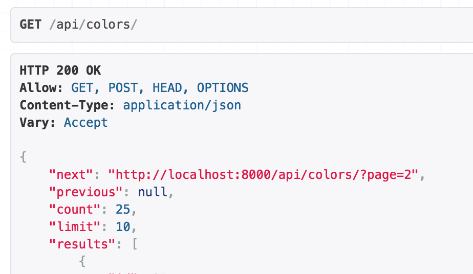

Django and Django Rest Framework so far are still my favourite framework because the default setting is already good, but if you want to override it to make it more custom, you're free to do that. In this case, we can create our own pagination class.

## Pagination Class

```
from rest_framework.pagination import PageNumberPagination
from rest_framework.response import Response


class CustomResultsSetPagination(PageNumberPagination):
    page_size = 10
    page_size_query_param = 'page_size'
    
    def get_paginated_response(self, data):
        return Response({
            'next': self.get_next_link(),
            'previous': self.get_previous_link(),
            'count': self.page.paginator.count,
            'limit': self.page_size,
            'results': data
        })
```

## How to use the pagination class

There are two ways to use the newly created pagination class:

### Change in settings:

This will setup every API's to use that pagination class.

```
REST_FRAMEWORK = {
    'DEFAULT_PAGINATION_CLASS': '<path-to-your-class>',
}
```

### Change in required Viewsets

If you only need the pagination class to one module, you can update in the viewset.

```
class ColorViewSet(viewsets.ModelViewSet):
    ...
    pagination_class = CustomResultsSetPagination
```


