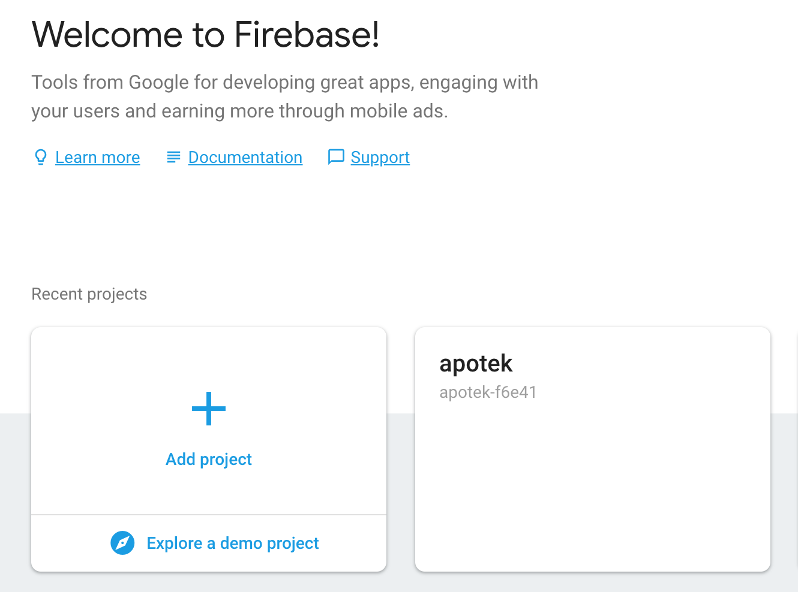
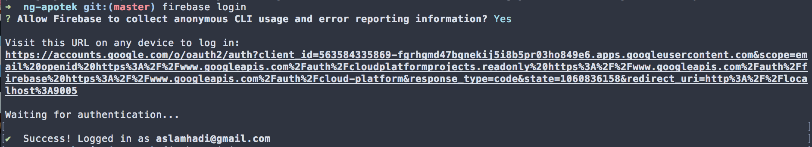
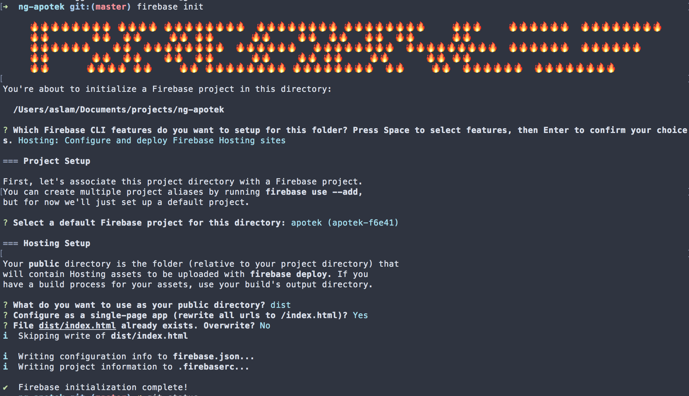
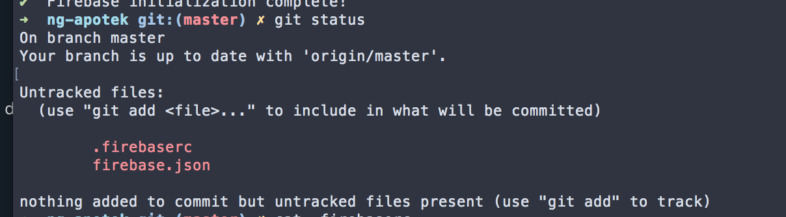
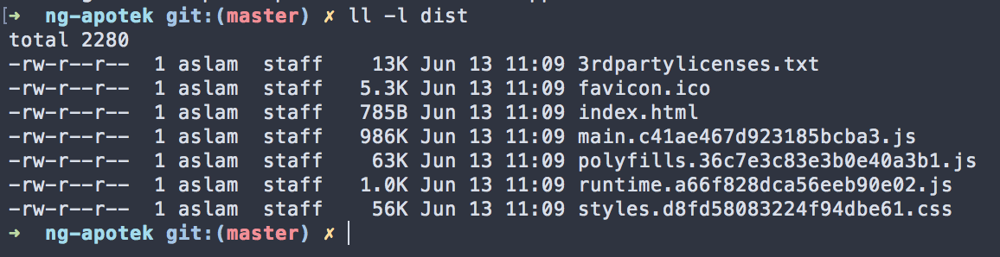
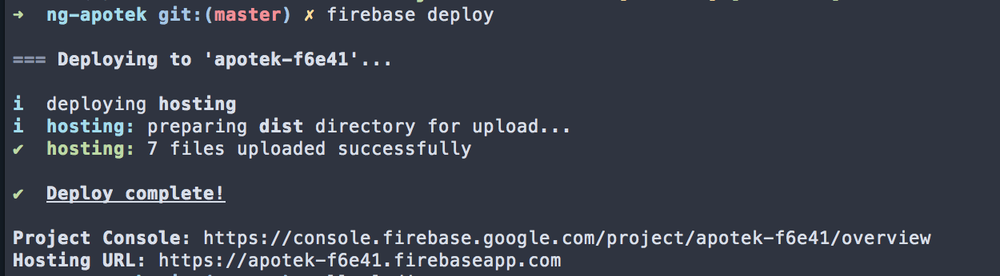
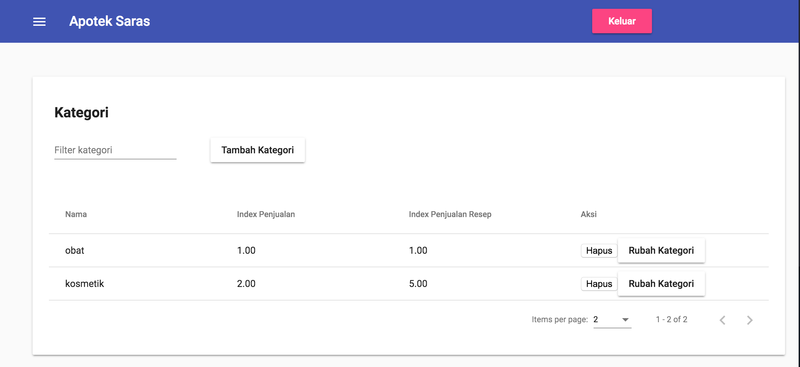

The advantage of using Angular is the tools around it. For UI interface we can use Google Material, for cli command we have Angular CLI, and for the hosting we can easily use Firebase. In this post we will learn how to deploy an Angular app with Firebase tools.

This post will assume you have an Angular app already.

## Create a Firebase Project

Visit Firebase and create a new project. In my case I have apotek project already.



## Firebase Tools time!

We're going to need this to setup firebase application and to deploy it.

```
npm install -g firebase-tools
```

## Login

Login with your firebase account

```
firebase login
```

You will see this if you succeed:



## Instantiate a Firebase application

This is like npm init, but Firebase style.

```
firebase init
```

Here's the answers to the questions from Firebase tools:

- Are you ready to proceed? Yes
- Which Firebase CLI features? Hosting
- Select a default Firebase project? apotek or whatever app you specified earlier
- What do you want to use as your public directory? dist from ng build --prod
- Configure as a single-page app? Yes



This will create .firebaserc and firebase.json.



## Deploy to Firebase


## Build Angular app using production settings

This will create dist folder containing all required files to run the app.

```
ng build --prod
```

You should have files like these:



## Deploy (the real one)

Deploy to firebase with only one command:

```
firebase deploy
```



Done!



