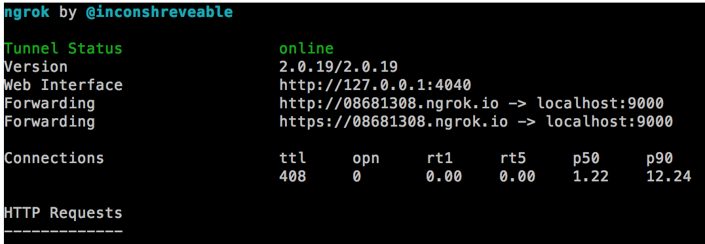

It's 2015 and I just know Ngrok recently! Once you know Ngrok, it won't be the same anymore. *ok this is too much.

What is Ngrok?
--------------

By using Ngrok, you can create a secure tunnels to localhost. It means that if you're working on a cafe, and your colleague is working from another cafe (the art of working from anywhere), you can share your localhost to your friend using Ngrok.

How to use Ngrok
----------------

* Download Ngrok from <a href="https://ngrok.com/download">here</a>
* Unzip it
* Type this in the terminal where you unzipped Ngrok, fill the port with the port you want to expose to your friend e.g. 9000
`./ngrok http [port]`

If you got that right, you can see something like this in the terminal:

Happy Ngrok-ing! :)
