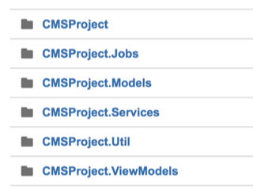
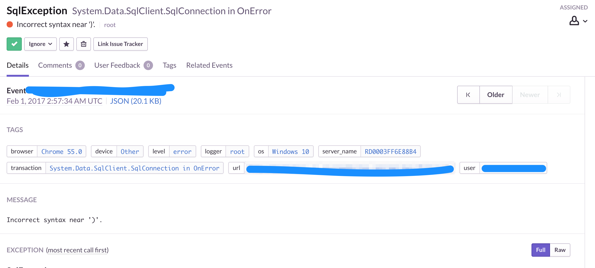

This is my first post in 2017 even though it's already February. And in this post I'm still going to write about .Net stuff because .Net is still quite popular here :)

### Sentry

Sentry is an error tracking application that gives you insight of how the crash happened with an awesome stack trace. I really like Sentry because the stack trace is really detail, and every time an error happens, I'll get an email (not really great when the email comes at weekend, but..yeah).

My project keeps growing everytime, we started using only one project in the solution project. But then the requirement keeps coming, from we need to set up Scheduler Job (using Quartz), the models keeps changing, etc.

By the time I wrote this, I separated the one project into six projects in one solution. And Sentry becomes a great pillar supporting this refactoring :)



### Setting up Sentry

First of all, register in Sentry website. After you've done this step, you will get your account like this one:

```
https://xxx@sentry.io/12345
```

install SharpRaven through nuget. SharpRacen is the .Net client for Sentry.

```
Install-Package SharpRaven
```

In my case, I need Sentry mainly to catch unhandled exception in the API, so I created BaseApiController. In this Controller, I override `OnException` so every time an unhandled exception occurs, this will send the report to Sentry and then return error JSON model which I set up before.

```
namespace YourProject.Api
{
    public class BaseApiController : Controller
    {
        private readonly RavenClient _ravenClient;

        public BaseApiController()
        {
            // store the Sentry account to static variable 
            _ravenClient = new RavenClient(Global.SentryAccount);
        }

        protected override void OnException(ExceptionContext filterContext)
        {
            // Send exception data to Sentry
            _ravenClient.Capture(new SentryEvent(filterContext.Exception));
            
            // Return JSON instead of showing error page
            var model = new ApiModel("UNHANDLED_ERROR", Global.InternalServerErrorCode, Global.InternalServerError, filterContext.Exception.Message);
            filterContext.Result = new JsonResult
            {
                Data = model,
                JsonRequestBehavior = JsonRequestBehavior.AllowGet
            };      
        }
    }
}
```

And then in every Controller you need to inherit `BaseApiController` above. That's it. Now every exception that happens in each `ActionResult` in the Controller will get reported to Sentry.

```
namespace CMSProject.Controllers.Api
{
    public class NewsApiController : BaseApiController
    {
        ...
    }
}
```

This is one of the issues look like in Sentry dashboard. You will have information about the user's browser, os, device, browser, etc.



Another awesome feature from Sentry is you can retest the issue after you fix it. So each issue has `curl` information in it. You can then just copy and paste that curl to your Terminal to retest the code. After that you can set the issue to resolved.
