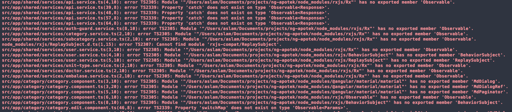

Angular 6 has been released and it contains a lot of new features. And a lot is saying that upgrading an app with Angular CLI will help a lot.

This is an official statement about Angular 6.

So because I also have an Angular app (still in 4th version), I tried to upgrade it as well, and it's relatively smooth like banana.

## Angular CLI

Angular CLI is a CLI tool to help developing Angular. It can generate a new component, serve angular app in local with ng serve, and it also can help updating package which we'll try to do.

**Note**: Both the CLI and generated project have dependencies that require Node 6.9.0 or higher, together with NPM 3 or higher.

## Install Angular CLI globally and locally:

```
npm install -g @angular/cli
npm install @angular/cli
ng update @angular/cli
```

After that we'll need to update the Angular CLI:

```
ng update @angular/cli
```

And then the Angular Core:

```
ng update @angular/core
```

Since I'm using Angular Material as well, I need to update it:

```
ng update @angular/material
```

After I did all of those, I got all this errors from breaking changes:



## Handling the breaking changes
### RxJs

One of the things that changes the most is the RxJs 6. It changes the import path shown in image above. The easiest way is just installing the compatibility module:

```
npm i rxjs-compat
```

### Angular Material

Before upgrading this, my angular material version is still at 2nd version so I have quite a lot errors when upgrading it. But it's fairly easy to upgrade it.

In my case I just need to change prefixes from md to mat and Md to Mat.

And that's it! We have the newest Angular! 🎉🎉🎉

